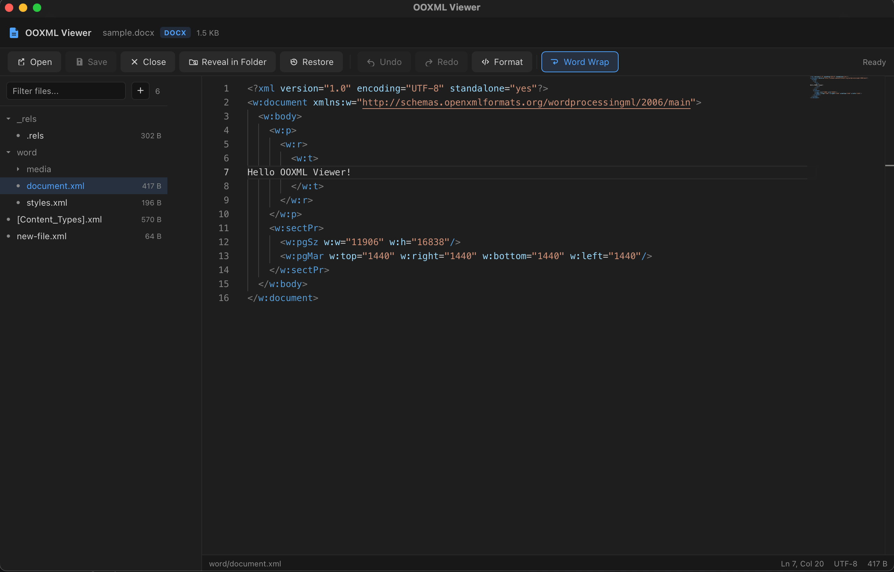

# OOXML Viewer

A desktop app built with **Tauri 2 + Vue 3 + TypeScript + Monaco Editor** for inspecting and editing the internal structure of OOXML files (`docx` / `xlsx` / `pptx`).

## Features

- **Open files**: drag & drop or pick a `docx` / `xlsx` / `pptx` file
- **Internal structure browser**: a tree view of every entry inside the archive
  - `xlsx` shows worksheet names directly (while keeping the original names like `sheet1.xml`)
- **Inline editing**: Monaco Editor for live editing of XML / JSON / JS / CSS and other text
  - XML formatting (⇧⌥F), word wrap, undo / redo (⌘Z / ⇧⌘Z)
- **Save**: after adding / deleting / editing entries, click "Save" to atomically rewrite the file; untouched entries keep their original compressed bytes
- **Undoable deletes**:
  - Before save: soft delete (shown with strikethrough), undoable from the row button or context menu
  - After save: the original file is backed up automatically, and the "Restore" toolbar button reverts to the last saved version
- **Undoable adds**: files can be un-added both before and after saving
- **Live preview**: a collapsible right-side panel renders the whole document — `docx` via [docx-editor](https://github.com/eigenpal/docx-editor) (viewing mode), `xlsx` via [SheetJS](https://sheetjs.com/), `pptx` via [pptx-preview](https://github.com/beaudar/pptx-preview)
- **Image preview**: `png` / `jpg` / `gif` / `webp` and other image entries render inline
- **Binary preview**: binary entries are shown as a read-only hex dump
- **Reveal in folder**: locate the current OOXML file in the system file manager
- **Export**: extract a specific entry to a local directory (with path-traversal protection)

## Screenshots



## Tech Stack

| Layer | Technology |
| --- | --- |
| Desktop shell | [Tauri 2](https://tauri.app/) (Rust) |
| Frontend | Vue 3 `<script setup>` + TypeScript + Vite |
| State | Pinia |
| Editor | Monaco Editor |
| Plugins | tauri-plugin-dialog, tauri-plugin-opener |

## Prerequisites

- Node.js ≥ 18
- Rust (stable)
- Tauri platform dependencies (on Linux you need WebKitGTK etc.; see the [Tauri prerequisites guide](https://tauri.app/start/prerequisites/))

## Getting Started

```bash
npm install          # install frontend dependencies
npm run tauri dev    # start the dev app (starts Vite and compiles Rust)
```

## Build & Test

```bash
npm run build        # frontend type-check + bundle (vue-tsc && vite build)
npm run tauri build  # build desktop installers (--bundles app for .app only)

cargo test --manifest-path src-tauri/Cargo.toml   # Rust unit tests
cargo fmt --manifest-path src-tauri/Cargo.toml -- --check
cargo clippy --manifest-path src-tauri/Cargo.toml --all-targets --all-features -- -D warnings
```

## Project Structure

```
.
├── src/                    # Vue frontend
│   ├── components/         # tree, editor, dialogs, etc.
│   ├── lib/                # invoke wrappers, tree building, XML formatter
│   ├── stores/             # Pinia store (open/edit/save/undo logic)
│   └── App.vue             # main UI
├── src-tauri/              # Tauri (Rust) backend
│   ├── src/lib.rs          # zip I/O, backup/restore, xlsx sheet-name parsing, etc.
│   └── capabilities/       # permission config
├── samples/                # sample docx/xlsx/pptx files for testing
└── .github/workflows/      # CI and release workflows
```

## CI / Releases

- `.github/workflows/ci.yml`: on PR / push — frontend type-check & build, Rust fmt / clippy / test
- `.github/workflows/release.yml`: on `v*` tags — builds macOS / Linux / Windows installers and creates a GitHub Release (draft)

## License

[MIT](LICENSE)
